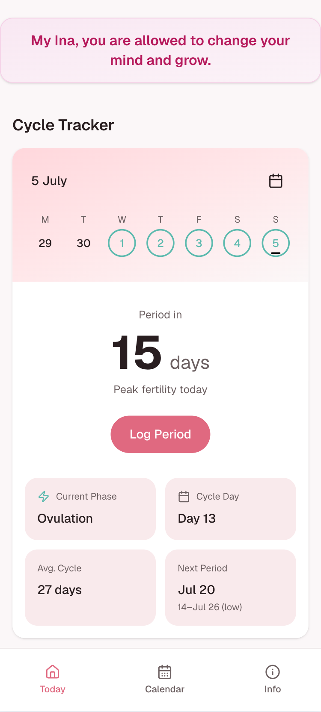
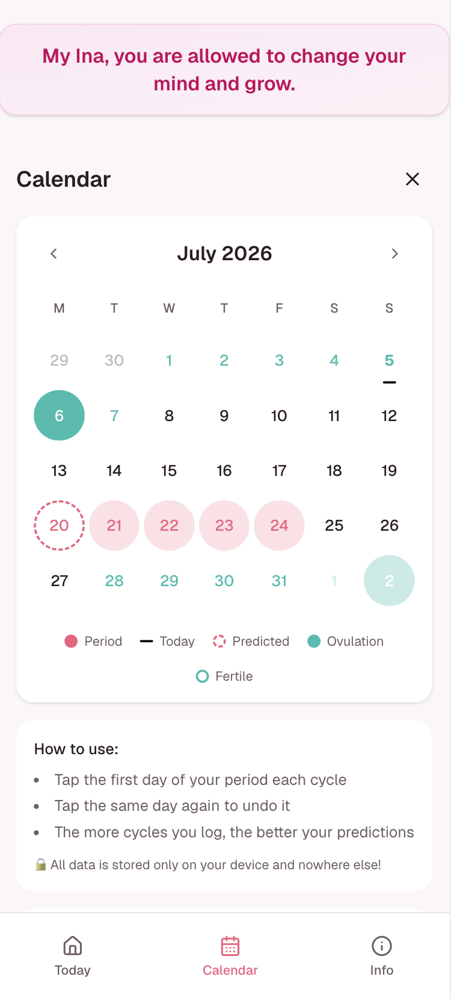

<div align="center">
  

  <h1>Cycle Tracker</h1>

  <p><em>Simple on-device period &amp; cycle tracker.<br/>
</div>

---

## Overview

A small, personal period tracker built with Next.js. You log a single thing —
the first day of each period — and the app predicts your next period, estimates
your fertile and ovulation window, and shows where you are in your current
cycle. Everything is stored locally on the device; nothing is ever uploaded.

> Built with love for Ina. 🌙

---

## Screens

<div align="center">
<table>
  <tr>
    <td width="50%" valign="top">
      
      <p align="center"><em>Today — status at a glance: days until next period, current phase, cycle day, and average cycle length.</em></p>
    </td>
    <td width="50%" valign="top">
      
      <p align="center"><em>Calendar — logged period days, predicted start, ovulation, and the fertile window.</em></p>
    </td>
  </tr>
</table>
</div>

---

## Features

- One-tap logging — tap the first day of a period; tap again to undo.
- Smart next-period prediction from your own history, weighted toward recent cycles.
- Forgotten-log recovery — a single missed entry won't throw off months of predictions.
- A prediction *window* (e.g. "Jul 20, 14–Jul 26")
- Ovulation and fertile-window estimates, current cycle phase, and cycle day.
- Regularity insight that widens or tightens predictions to match how variable your cycles actually are.
- Fully private — all data stays on your device, no account, no network.

---

## How predictions work

The whole model runs from one input per cycle: the first day of bleeding. From
`N` logged start dates it derives `N−1` cycle lengths and works from there.

**1. Data hygiene (before any math).**
Raw cycle lengths are cleaned first. If a period was never logged, the app sees
one gap that's roughly `2×` or `3×` a normal cycle; it detects those (when a gap
is within ±25% of `k × typical`) and splits them back into `k` cycles instead of
averaging in a fake long one. Gaps under 10 days are dropped as spotting or
mis-taps, and only the most recent 12 valid cycles are used so the model tracks
real change without being dragged down by old history. This skipped-log handling
is the single biggest accuracy win over a naive tracker.

**2. Next cycle length — recency-weighted mean.**
Recent cycles count more, via an exponential weight `0.5 ^ (age / 3)`: the newest
cycle has full weight, three cycles back counts half, six back a quarter. A real
change (life event, hormonal shift) takes over the estimate within a few cycles.

**3. Cold start.**
With fewer than three cycles logged, the estimate is shrunk toward a population
prior of 29 days — `(n × userMean + 2 × 29) / (n + 2)` — so one unusual early
cycle can't produce a wild prediction. The prior fades as real data accumulates.

**4. Prediction window.**
Alongside the point estimate, a window is derived from the standard deviation of
recent cycles (clamped to 1–10 days). A narrow window means a regular cycle; a
wide one honestly signals variability.

**5. In-cycle updating.**
If today is already past the predicted date, the window widens, and once the
current gap reaches `1.8×` the typical cycle the app flags a possibly missed log
and prompts you to check.

**6. Regularity classification.**
Using the median Cycle Length Difference (CLD) between consecutive cycles:

| Median CLD | Classification | Prediction behaviour             |
|-----------:|----------------|----------------------------------|
| 0–2 days   | Regular        | Narrow window, high confidence   |
| 3–5 days   | Moderate       | Medium window, medium confidence |
| 5+ days    | Irregular      | Wide window, low confidence      |

**7. Ovulation & fertile window (derived).**
Estimated from the predicted cycle, not sensors:

```
ovulationDay  = nextPredictedStart − 14 days
fertileWindow = ovulationDay − 5  →  ovulationDay + 1
```

The ~14-day luteal phase (ovulation → next period) is the most constant part of
the cycle across individuals, so it's the most reliable thing to back-calculate.
The 6-day fertile window covers sperm viability (~5 days) plus egg lifespan (~1 day).

### Population reference values

Constants used as priors and sanity bounds:

| Quantity      | Typical mean | Typical SD (individual) | Outlier bound                                   |
|---------------|-------------:|-------------------------|-------------------------------------------------|
| Cycle length  | 29 days      | 3–4 days                | <21 or >45 suspicious; >90 = almost certainly a missed log |
| Period length | 4–5 days     | ~2 days                 | >10 days = outlier                              |
| Luteal phase  | 14 days      | ~2 days                 | Used for ovulation back-calculation             |

---

## Privacy

All cycle data is stored only on the device and never leaves it — no accounts,
no servers, no analytics. The lock note in-app says exactly that, and it's true
by design.

---

## Getting started

Standard Next.js (App Router):

```bash
npm install
npm run dev      # http://localhost:3000
```

Build for production:

```bash
npm run build
npm run start
```

App icons live in the App Router `app/` directory (`icon.svg`, `favicon.ico`,
`apple-icon.png`), so Next.js wires up the favicon tags automatically.

---

## Disclaimer

This app is for personal awareness only. It is **not** a contraceptive method —
calendar-based fertile-window estimates are well-documented to be unreliable for
preventing pregnancy — and it is not medical advice. For anything health-related,
talk to a clinician.

---

## Prediction model sources

- Li et al., *A generative, predictive model for menstrual cycle lengths that accounts for potential self-tracking artifacts* (Columbia / Clue) — arXiv:2102.12439
- Li et al., *Characterizing physiological and symptomatic variation in menstrual cycles using self-tracked mobile health data* — arXiv:1909.11211
- Bull et al., *Real-world menstrual cycle characteristics of more than 600,000 menstrual cycles* — npj Digital Medicine
- Oliveira et al., *Modelling menstrual cycle length in athletes using state-space models*